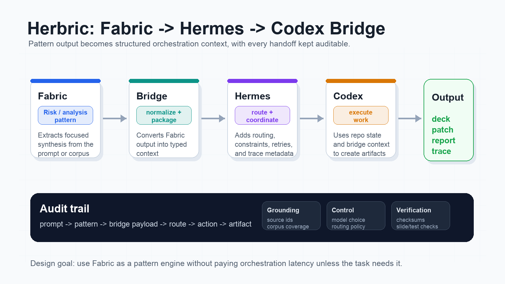
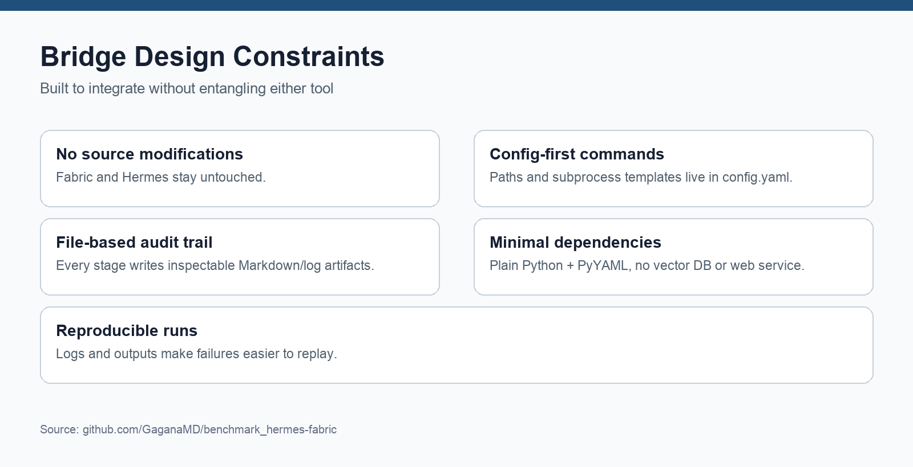
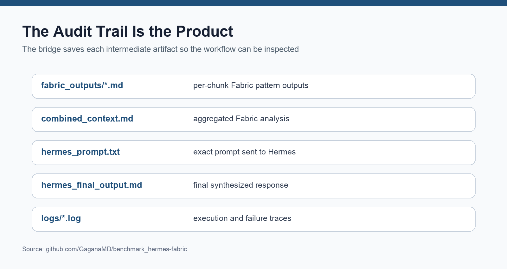

# Herbric

A lightweight **Fabric -> Hermes bridge** for long-context research and diligence workflows.

Herbric keeps Fabric and Hermes as separate tools and connects them through a small Python orchestration layer. The bridge chunks input, runs Fabric patterns over each chunk, aggregates the results into a structured context file, and sends that context to Hermes for final synthesis.

Repository: <https://github.com/GaganaMD/herbric>

Related benchmark repo: <https://github.com/GaganaMD/benchmark_hermes-fabric/>

## Why Herbric Exists

Long-context workflows often fail because one agent is asked to do too much in one pass:

- ingest raw evidence,
- compress noisy text,
- identify claims and risks,
- preserve contradictions,
- synthesize final recommendations,
- and produce a clean final artifact.

Herbric splits that work into stages:

- **Fabric** performs repeated chunk-level semantic analysis.
- **The bridge** preserves intermediate artifacts, logs, and aggregation structure.
- **Hermes** performs final synthesis over structured context.

The design goal is not maximum abstraction. It is inspectability.

## Pipeline



```text
input document
  -> chunker.py
  -> Fabric patterns per chunk
  -> fabric_outputs/*.md
  -> combined_context.md
  -> Hermes prompt
  -> Hermes final synthesis
```

## Design Constraints



Herbric is intentionally small:

- no Fabric source modifications,
- no Hermes source modifications,
- no vector database,
- no web service,
- no framework-heavy orchestration,
- config-first command templates,
- file-based intermediate artifacts,
- reproducible logs.

This makes the integration easy to inspect and easy to debug.

## Audit Trail



Every run can leave a traceable chain of artifacts:

```text
bridge/out/fabric_outputs/*.md
bridge/out/combined_context.md
bridge/out/hermes_prompt.txt
bridge/out/hermes_final_output.md
bridge/out/logs/*.log
```

Those files are useful because they let you inspect the path from raw input to final synthesis rather than only trusting the final answer.

## Repository Structure

```text
bridge/
  README.md
  BRIDGE_DETAILED_README.md
  config.yaml
  requirements.txt
  run_pipeline.py
  chunker.py
  fabric_runner.py
  hermes_runner.py
  utils.py
  small_input.txt
  out/

research/
  hermes_fabric_integration_analysis.md
  Hermes_vs_Hermes+Fabric.md

docs/
  BRIDGE_INTERNAL_ARCHITECTURE_DEEP_DIVE.md
  assets/

hermes_tonbo_visual_upgrade/
  scripts/
```

Historical DD/demo inputs, generated decks, scraped logs, raw visual assets, and extracted workbook artifacts are kept local-only and ignored by Git because they may contain company-sensitive material.

## Quick Start

Install the bridge dependency:

```bash
python -m pip install -r ./bridge/requirements.txt
```

Edit `bridge/config.yaml` for your local Fabric and Hermes commands:

```yaml
paths:
  input_file: "./bridge/small_input.txt"
  output_dir: "./bridge/out"

fabric:
  enabled: true
  command: "fabric"
  patterns:
    - extract_wisdom
    - summarize
    - analyze_claims
    - create_5_sentence_summary

hermes:
  enabled: true
  command: "hermes"
```

Run the bridge:

```bash
python ./bridge/run_pipeline.py --config ./bridge/config.yaml
```

Outputs are written under `bridge/out/`.

## How It Works

### 1. Chunking

`bridge/chunker.py` splits input text into manageable chunks. It prefers paragraph boundaries, falls back to sentence-ish splitting, and supports overlap.

### 2. Fabric Pattern Runs

`bridge/fabric_runner.py` executes configured Fabric patterns on each chunk. Each pattern output is saved separately under `bridge/out/fabric_outputs/`.

### 3. Aggregation

`bridge/run_pipeline.py` combines the chunk/pattern outputs into `combined_context.md`, preserving pattern identity and chunk order.

### 4. Hermes Synthesis

`bridge/hermes_runner.py` sends the aggregated context into Hermes using a configurable command template and writes the final result to `hermes_final_output.md`.

## Example Use Cases

Herbric is useful for workflows where final answers need traceability:

- investor due diligence,
- long-document research,
- claim/risk extraction,
- source-grounded synthesis,
- reconciliation narratives,
- board/investment memo preparation,
- corpus-level summarization.

## Benchmark Context

The companion benchmark repo evaluates direct Codex, Fabric + Codex, and Hermes + Fabric + Codex across:

1. small coding tasks,
2. invoice reconciliation,
3. due diligence deck generation.

Benchmark artifacts: <https://github.com/GaganaMD/benchmark_hermes-fabric/>

The main benchmark takeaway is that orchestration adds latency, but can become worthwhile when a workflow requires coverage, auditability, recovery behavior, and source-grounded verification.

## Notes

- Herbric communicates through CLI commands and files, not internal APIs.
- Subprocess/file boundaries are slower than deeper integration but easier to inspect.
- The bridge is intended as a minimal integration surface, not a full agent framework.
- The default command templates may need adjustment for your shell, Fabric install, and Hermes install.

## License

See [`LICENSE`](LICENSE).
